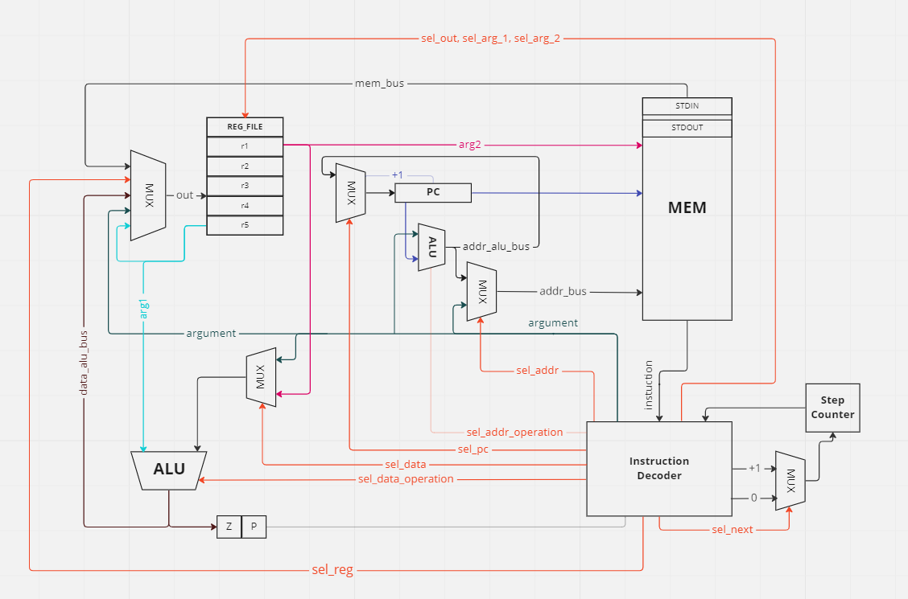

# Assembler. Транслятор и модель

- Мокров Семён Андреевич, гр. Р33121
- `asm | risc | neum | hw | tick | struct | stream | mem | prob5`

## Язык программирования

``` ebnf
program ::= <section_data> <section_text> | <section_text> <section_data> | <section_text>

<section_data> ::= "section .data\n" <declaratione>*

<section_text> ::= "section .text\n" <instruction>*

<declaration> ::= <comment>* "\t"* (<variable> | <value>) "\n" <comment>*

<instruction> ::= <comment>* "\t"* (<label> | <command>) "\n" <comment>*

<label> ::= "." <name> ":"

<variable> ::= <name> ":"

<name> ::= [a-zA-Z]+

<value> ::= <number> | <char>

<comment> ::= ; <any sequence>

<command> ::= <operation_3_args> | <operation_2_args> | <operation_1_arg> | <operation_0_args>

operation_3_args ::= ("ADD" | "SUB" | "DIV" | "MOD" | "MUL") " " (<register_register_value> | <register_register_register>)

<register_register_value> ::= <reg> ", " <reg> ", " <number | char>

<register_register_register> ::= <reg> ", " <reg> ", " <reg>

operation_2_args ::= ("CMP" | "LD" | "ST" | "MOV") " " (<register_register> | <register_var_name> | <var_name_register>)

<register_register> ::= <reg> ", " <reg>

<register_var_name> ::= <reg> ", " "(" <name> ")"

<var_name_register> ::=  "(" <name> ")" ", " <reg>

operation_1_arg ::= ("JMP" | "JE" | "JNE" | "JG" | "INC" | "DEC") " " (<label> | <reg>)

operation_0_args ::= "HLT"

<reg=> ::= "r1" | "r2" | "r3" | "r4" | "r5" 

<char> ::= "<any ASCII symbol>"
          
<number> ::= [-2^64; 2^64 - 1]

```

Поддерживаемые аргументы:

- **регистр** - `%r1`. Всего регистров 5: r1, r2, r3, r4, r5.
- **объявленная метка** - `.<label>:`.
- **адрес памяти** - `#1`. Рекомендуется использовать **только**
  с зарезервированными переменными. **Нельзя** использовать с именами объявленных переменных
- **объявленная переменная** - `(NAME)`. Переменная обязательно должна находиться в скобках.
- **символ** - `'a'`. Транслируется в код ASCII. **Нельзя** указывать несколько символов сразу (строки не поддерживаются). Символ обязательно должен находиться в одинарных кавычках
- **целое число** в диапазоне [-2^64 ; 2^64 - 1].


Виды операций:

- **регистровая** операция - может использовать в качестве операндов регистры или значения: символ, число. Первые n-1 операндов должны быть регистрами (n - кол-во операндов, если n = 1, то операнд должен быть регистром).
- операция **перехода** - может поддерживать метки в качестве операндов. Должна иметь 1 операнд-метку.
- операция **по работе с памятью** - может поддерживать адреса и имена переменных в качестве операндов. Один из операндов должен быть регистром
- часть операций может соблюдать ограничения, иметь свои ограничения на операнды или может не иметь операндов вовсе (см. операции)


Код находится в `section .text` и выполняется последовательно. Операции:

- `ADD <arg1> <arg2> <arg3>` -- прибавить ко второму аргументу третий, результат поместить в первый. *Регистровая операция*.
- `SUB <arg1> <arg2> <arg3>` -- вычесть из второго аргумента третий, результат поместить в первый. *Регистровая операция*
- `DIV <arg1> <arg2> <arg3>` -- получить целую часть от деления второго аргумента на третий, результат поместить в первый. *Регистровая операция*
- `MOD <arg1> <arg2> <arg3>` -- получить остаток от деления второго аргумента на третий, результат поместить в первый. *Регистровая операция*
- `MUL <arg1> <arg2> <arg3>` -- получить произведение второго аргумента на третий, результат поместить в первый. *Регистровая операция*
- `MOV <arg1> <arg2>` -- скопировать значение из второго аргумента в первый. *Регистровая операция*
- `CMP <arg1> <arg2>` -- получить результат сравнения второго аргумента с первым (0, если аргументы равны). *Регистровая операция*
- `LD <arg1> <arg2>` -- загрузить в 1 операнд 2. 2 операндом может выступать только адрес или имя ячейки, 1 операндом может выступать только регистр. *Регистровая операция* и операция *по работе с памятью*
- `ST <arg1> <arg2>` -- загрузить в 2 операнд 1. 1 операндом может выступать только адрес или имя ячейки, 2 операндом может выступать только регистр. *Регистровая операция* (нарушает общие правила) и операция *по работе с памятью*
- `INC <arg>` -- инкрементировать операнд (+1). Может иметь в качестве операнда только регистр. *Регистровая операция*
- `DEC <arg>` -- декрементировать (-1) операнд. Может иметь в качестве операнда только регистр. *Регистровая операция*
- `JE <label>` -- если результат предыдущей операции равен 0, перейти на аргумент-метку. *Операция перехода*
- `JNE <label>` -- если результат предыдущей операции не равен 0, перейти на аргумент-метку. *Операция перехода*
- `JG <label>` -- если результат предыдущей операции больше 0, перейти на аргумент-метку. *Операция перехода*
- `JMP <label>` -- безусловный переход на аргумент-метку. *Операция перехода*
- `HLT` -- завершить выполнение программы

Переменные объявляются в `section .data` и имеют следующий синтаксис - `<VAR>: <value>`:
- `<VAR>` - имя переменной. При обращении к нему необходимо учитывать регистр. Имя не должно иметь пробелов и должно заканчиваться символом `:`
- `<value>` - значение переменной. Может быть числом или символом (`'a'`). Правила записи те же, что и для аргументов.
- Одна переменная должна располагаться на 1 строчке.
- Не имеют фиксированного адреса  памяти.

Дополнительные конструкции:

- `; <any sequence not containing ';'>` - комментарий
- `section .text` - объявление секции кода
- `section .data` - объявление секции данных
- `.<label>:` - метки для переходов / названия переменных. Могут быть объявлены только в `section .text`. Должны располагаться на отдельной строчке

Зарезервированные переменные:
  - Имеют фиксированный адрес в памяти
  - Возможно обратиться только напрямую через адрес в памяти (#STDIN)
  - При трансляции превращаются в их адрес
  - Виды:
    - ```STDIN``` - при чтении переменной происходит ввод данных. В переменную нельзя записывать.
    - ``STDOUT`` - при записи в переменную происходит вывод данных. Из переменной нельзя читать.


Примечания:

- Результаты операций с 3 аргументами (если он есть) помещаются в 1 аргумент
- Должен присутствовать `section .text` - тело программы
- Должна присутствовать метка `.start:` в `section .text` - точка входа в программу
- При обращении к необъявленной метке или переменной возникнет ошибка.
- Все составляющие языка **регистрозависимы**

## Организация памяти
- Есть возможность объявления переменных в `section .data`

Модель памяти процессора:

- Память данных. Машинное слово -- 64 бит, знаковое. Реализуется списком инструкций процессора - `Operation`.

Типы адресации:

- Прямая регистровая: операндом инструкции является регистр.
- Непосредственная загрузка: операндом является константа, подаваемая как один из аргументов.
- Прямая абсолютная: операндом инструкции является адрес памяти
- Прямая относительная: операндом инструкции является смещение относительно текущей инструкции


## Система команд

### Особенности процессора:

- **Машинное слово** -- 64 бита, знаковое.
- **Память:**
    - адресуется через регистры `pс_counter` и через шину данных `addr_bus`;
    - может быть записана из регистрового файла;
    - может быть прочитана в регистровый файл или в `Instruction Decoder`;
    - имеет зарезервированные ячейки для подключения потоков ввода-вывода (задаются через конфигурацию).
- **Регистровый файл**:
    - состоит из регистров общего назначения размером с машинное слово
    - регистры расположены последовательно
    - всего регистров 5: *r1, r2, r3, r4, r5* (количество и названия регистров можно изменить в конфигурации)
    - имеет два выхода и 1 вход: `argument_1`, `argument_2`, `out`. Устанавливаются при помощи сигналов Instruction Decoder.
    - регистр, подключенный к `out`, может быть записан из памяти, АЛУ (связанного с ним), регистра, подключенного к `argument_1` или операндом из `Instruction Decoder`
    - регистр, подключенный к `argument_1` может быть прочитан в левый вход к АЛУ (подключенному к регистровому файлу) или в регистр, подключенный к `out`
    - регистр, подключенный к `argument_2` может быть прочитан в память или на правый вход АЛУ (подключенного к регистровому файлу)
- **АЛУ, соединенный с регистровым файлом**:
  - имеет два входа и 1 выход
  - прозводит арифметические операции с регистрами общего назначения и аргументами из Instruction Decoder
  - управляется сигналами из Instruction Decoder
  - устанавливает флаг равенства нулю и флаг положительного результата по результату вычисленной операции
  - умеет складывать, вычитать, умножать, делить нацело, получать остаток от деления
  - результат вычислений записывается в регистр общего назначения
- **АЛУ, соединенный с регистровым файлом**:
  - имеет два входа и 1 выход
  - прозводит арифметические операции с `pc_couner` и аргументами из Instruction Decoder
  - управляется сигналами из Instruction Decoder
  - умеет складывать, вычитать, умножать, делить нацело, получать остаток от деления
  - результат вычислений записывается в `pc_counter` или передается на шину `addr_bus`
  - используется для вычисления смещения
- **step_counter** -- счетчик шагов:
  - отвечает за хранения номера шага текущей команды
  - меняет значение каждый такт
  - меняется через аргументы от Instruction Decoder
  - может быть обнулен или увеличен на 1
- **Instruction Decoder** -- декодировщик инструкций:
  - отвечает за декодирование и исполнение инструкций
  - отправляет управляющие сигналы
  - может читать инструкцию из памяти, флаги, установленные АЛУ, и step_counter
- **Ввод-вывод** -- memory-mapped через резервированные ячейки памяти, символьный. Ячейки задаются через конфигурацию.
- **pс_counter** -- счётчик команд:
    - инкрементируется после каждой инструкции или перезаписывается инструкцией перехода (с учетом смещения).

### Набор инструкций

Аргументы и их ограничения:
- число в диапазоне [-2^64 ; 2^64 - 1]
- смещение относительно текущего значения `pc_counter` - сумма не должна выходить за пределы памяти
- адрес в памяти  - адрес не должен выходить за пределы памяти
- регистр - должен находиться в регистровом файле
- ограничения на аргументы у каждой отдельной инструкции выходят из языка программирования (см п.1)

| Syntax                                  | Mnemonic                                | Ticks | Comment                                                                                                                                             |
|:----------------------------------------|:----------------------------------------|-------|:----------------------------------------------------------------------------------------------------------------------------------------------------|
| `add/sub/mul/div/mod <arg> <arg> <arg>` | ADD/SUB/MUL/DIV/MOD `<arg> <arg> <arg>` | 3     | кол-во тактов фиксировано                                                                                                                           |
| `cmp <arg> <arg>`                       | CMP `<arg>`                             | 2     | кол-во тактов фиксировано                                                                                                                           |
| `mov <arg> <arg>`                       | MOV `<arg> <arg>`                       | 3     | кол-во тактов фиксировано                                                                                                                           |
| `je, jne, jg, jmp <arg>`                | JE, JNE, JG, JMP `<arg> <arg>`          | 2-3   | кол-во тактов зависит от флагов АЛУ <br/>работают только с относительной адресацией                                                                 |
| `inc/dec <arg>`                         | INC/DEC `<arg>`                         | 3     | кол-во тактов фиксировано                                                                                                                           |
| `hlt`                                   | HLT                                     | 0     | вызывает остановку симуляции                                                                                                                        |
| `data <arg>`                            | DATA `<arg>`                            | 0     | инструкция хранения данных - реализует ячейки памяти с данными                                                                                      |
| `ld <arg> <arg>`                        | LD `<arg> <arg>`                        | 3-4   | Выполняет чтение из указанной ячейки памяти<br/>Поддерживает абсолютную и относительную адресации<br/>Количество тактов зависит от режима адресации |
| `st <arg> <arg>`                        | ST `<arg> <arg>`                        | 2-3   | Выполняет запись в указанную ячейку памяти<br/>Поддерживает абсолютную и относительную адресации<br/>Количество тактов зависит от режима адресации  |

### Кодирование инструкций

- Машинный код сериализуется в список JSON.
- Один элемент списка, одна инструкция.
- Инструкция имеет фиксированный размер - машинное слово

Пример:

```json
[{
        "opcode": "mov",
        "position": 1,
        "args": [
            {
                "data": "r4",
                "mode": "register"
            },
            {
                "data": 20,
                "mode": "data"
            }
        ]
    }
]
```

где:

- `opcode` -- строка с кодом операции;
- `position` -- позиция инструкции в памяти
- `args` -- аргументы инструкции:
  - `mode` -- режим адресации аргумента
  - `data` -- значение аргумента

Типы данных в модуле [isa](./src/translation/isa.py), где:

- `Opcode` -- перечисление кодов операций;
- `AddrMode` -- перечисление режимов аддресации:
  - `REG` -- аргумент является регистром. Поле `data`: регистр
  - `REL` -- аргумент отражает относительную адресацию. Поле `data`: смещение
  - `ABS` -- аргумент отражает прямую адресацию. Поле `data`: адрес
  - `DATA` -- аргумент является значением. Поле `data`: число
- `Operation` -- структура для описания всей необходимой информации об инструкции.
- `Argument` -- структура для описания всей необходимой информации об аргументе


## Транслятор

Интерфейс командной строки: `translator.py <input_file> <target_file>"`

Реализовано в модуле: [translator](src/translation/translator.py)

Этапы трансляции (функция `translate`):

1. Препроцессирование исходного кода: удаление лишних пробелов, запятых, комментариев. Реализовано в функции `preprocessing` модуля [preprocessor](src/translation/preprocessor.py)
2. Проверка наличия метки `.start`
3. Преобразование `section .text` в машинный код (с учетом ограничений) - функция `parse_text`
4. Преобразование `section .data` в машинный код (с учетом ограничений) - функция `parse_data`
5. Объединение машинных кодов двух секций и определение адресов переменных внутри команд - функция `join_text_and_data`
6. Установка стартового адреса программы (с учетом смещения относительно данных и зарезервированных ячеек) - функция `add_start_address`

Правила генерации машинного кода:

- один `Operation` (класс, описывающий операцию) -- одна инструкция;
- в начале каждой программы стоит команда `jmp`, которая указывает на стартовый адрес
- вместо регистров подставляются их имена (экземпляры enum `Register`)
- вместо адресов в памяти подставляются сами адреса или адреса зарезервированных ячеек (если они используются)
- вместо переменных подставляется смещение относительно текущего адреса,
- вместо меток подставляется смещение относительно текущего адреса до ячеек памяти, на которые они указывают.
- вместо символов подставляются их ASCII коды
- числа остаются числами

## Модель процессора
### Схема DataPath и ControlUnit

### DataPath
Реализован в классе `DataPath`

- `memory` -- однопортовая, поэтому либо читаем, либо пишем.
- `reg_file` -- устройство управления регистрами. Получает на вход сигналы с операндами и регистром для записи.
- - `reg_file.argument_1` -- регистр, данные из которого будут поданы на левый вход АЛУ или на регистровый файл
- - `reg_file.argument_2` -- регистр, данные из которого будут поданы на правый вход АЛУ или в память
- - `reg_file.out` -- регистр, в который будут считаны данные при подаче сигнала
- `addr_alu` -- АЛУ, вычисляющее относительный адрес.
- - `addr_alu.left` -- данные с левого входа АЛУ
- - `addr_alu.right` -- данные с правого входа АЛУ
- `data_alu` -- АЛУ, выполняющее арифметические операции со значениями из регистрового файла.
- - `data_alu.left` -- данные с левого входа АЛУ
- - `data_alu.right` -- данные с правого входа АЛУ
- `pc_counter` -- счетчик команд
- `data_alu_bus` -- шина, выходящая из `data_alu` на `reg_file`.
- `addr_alu_bus` -- шина, соединяющая выход с `addr_alu` и мультиплексор, определяющий значение `addr_bus`.
- `addr_bus` -- шина, содержащая адрес для обращения (чтения или записи) в память. Соединяет мультиплексор и `memory`
- `mem_bus` -- шина, соединяющая `memory` и `reg_file`
- `input_buffer` -- буфер с входными данными (привязан к ячейке памяти)
- `output_buffer` -- буфер с выходными данными (привязан к ячейке памяти)

Сигналы:

- `set_regs_args` -- подать сигнал RegFile с данными о регистрах 
- `latch_register` -- защелкнуть данные, идущие в регистровый файл, на регистре `reg_file.out`. Источник данных выбирается в зависимости от сигнала `sel_reg`.
- `latch_addr_bus` -- поместить данные на шину, определяющую адрес чтения / записи
- `latch_pc` -- защелкнуть данные в счетчик команд
- `set_data_alu_args (const_operand)` -- защелкнуть входы `data_alu`. При подаче const_operand помещается на правый вход (sel_data).
- `set_addr_alu_args (const_operand)` -- защелкнуть входы `addr_alu`. При подаче const_operand помещается на правый вход (sel_data).
- `execute_data_alu` -- рассчитать выходное значение `data_alu`, подав на него сигнал с операцией, закрепить его на шине `data_alu_bus`.
- `execute_addr_alu` -- рассчитать выходное значение `addr_alu`, подав на него сигнал с операцией, закрепить его на шине `addr_alu_bus`.
- `read` -- считать значение из памяти по адресу из `addr_bus` и поместить его на шину `mem_bus`.
- `write` -- записать значение `reg_file.argument_2` в память по адресу из `addr_bus`.

Флаги:

- `_zero_flag` -- отражает наличие нулевого значения на выходе АЛУ, соединенного с регистровым файлом. Используется для условных переходов.
- `_positive_flag` -- отражает наличие положительного значения на выходе АЛУ, соединенного с регистровым файлом. Используется для условных переходов.

### ControlUnit
Реализован в классе `ControlUnit`
- Hardwired (реализовано полностью на python).
- Моделирование на уровне тактов.
- Трансляция инструкции в последовательность сигналов (с учетом текущего такта): `decode_and_execute_instruction`.
- Содержит `step_counter`

Сигналы:

- `latch_inc_program_counter` -- сигнал для увеличения счётчика команд на 1 в DataPath.
- `latch_step_counter` -- защелкнуть значение счетчика шагов в ControlUnit (в зависимости от `seg_next`).

Особенности работы модели:

- Для журнала состояний процессора используется стандартный модуль logging.
- Количество инструкций для моделирования ограничено hardcoded константой.
- Остановка моделирования осуществляется при помощи исключений:
    - `IndexError` -- если нет данных для чтения из порта ввода-вывода;
    - `StopIteration` -- если выполнена инструкция `HLT`.
- Управление симуляцией реализовано в функции `simulate`.

## Апробация
Реализовано несколько видов тестов (использовался `unittest`):
 - интеграционные тесты: [integration_test](test/integration_test.py)
 - юнит-тесты транслятора: [unit_translator_test](test/unit_translator_test.py)
 - юнит-тесты валидации: [unit_validation_test](test/unit_validation_test.py)
 - юнит-тесты процессора: [unit_machine_test](test/unit_machine_test.py)

Все материалы, использующиеся в тестах: [test](test)

В интеграционных тестах (и частично в юнит-тестах транслятора) реализовано 3 алгоритма:
  - [hello_world](resources/source/hello.asm)
  - [cat](resources/source/cat.asm)
  - [prob5](resources/source/prob5.asm)

Для остальных тестов алгоритмы были написаны отдельно и отражают одну из ключевых зон работы модуля:
  - юнит-тесты процессора: [examples_correct](resources/examples_correct)
  - юнит-тесты валидатора: [incorrect](resources/incorrect)

### CI
```yaml
lab3:
  stage: test
  image:
    name: python-tools
    entrypoint: [""]
  script:
    - python3-coverage run -m pytest --verbose
    - find . -type f -name "*.py" | xargs -t python3-coverage report
    - find . -type f -name "*.py" | xargs -t pep8 --ignore=E501
    - find . -type f -name "*.py" | xargs -t pylint --disable=C0301,R0903,R1702,R0912,R0915,R0916,R0902
    - find . -type f -name "*.py" | xargs -t mypy --check-untyped-defs --explicit-package-bases --namespace-packages
```

где:

- `python3-coverage` -- формирование отчёта об уровне покрытия исходного кода.
- `pytest` -- утилита для запуска тестов.
- `pep8` -- утилита для проверки форматирования кода. `E501` (длина строк) отключено.
- `pylint` -- утилита для проверки качества кода. Некоторые правила отключены с целью упрощения кода.
- `mypy` -- утилита для проверки корректности статической типизации.
  - `--check-untyped-defs` -- дополнительная проверка.
  - `--explicit-package-bases` и `--namespace-packages` -- помогает правильно искать импортированные модули.
- Docker image `python-tools` включает в себя все перечисленные утилиты. Его конфигурация: [Dockerfile](./Dockerfile).

### Пример использования

Пример использования и журнал работы процессора на примере `cat`:

``` commandline
$ cat resources/input.txt
Do!;,
@1

$ cat resources/source/cat.asm
section .text
.start:
    .read_char:
        LD %r2, #STDIN
        ST #STDOUT, %r2
        JMP .read_char
        
$ py ./translation/translator.py resources/source/cat.asm resources/result/cat.json
source LoC: 6 instr: 4

$ cat resources/result/cat.json
[
    {
        "opcode": "jmp",
        "position": 0,
        "args": [
            {
                "data": 1,
                "mode": "relative"
            }
        ]
    },
    {
        "opcode": "ld",
        "position": 1,
        "args": [
            {
                "data": "r2",
                "mode": "register"
            },
            {
                "data": 0,
                "mode": "absolute"
            }
        ]
    },
    {
        "opcode": "st",
        "position": 2,
        "args": [
            {
                "data": 1,
                "mode": "absolute"
            },
            {
                "data": "r2",
                "mode": "register"
            }
        ]
    },
    {
        "opcode": "jmp",
        "position": 3,
        "args": [
            {
                "data": -2,
                "mode": "relative"
            }
        ]
    }
]

$ py machine.py resources/result/cat.json resources/input.txt
DEBUG:root:TICK: 0, PC: 2, ADDR_BUS: 0, R1: 0, R2: 0, R3: 0, R4: 0, R5: 0, D_ALU_BUD: 0, A_ALU_BUD: 0, MEM_BUS: 0, Z: False, P: False, STEP_COUNTER: 0 -
DEBUG:root:TICK: 1, PC: 2, ADDR_BUS: 0, R1: 0, R2: 0, R3: 0, R4: 0, R5: 0, D_ALU_BUD: 0, A_ALU_BUD: 0, MEM_BUS: 0, Z: False, P: False, STEP_COUNTER: 0 
CELL_NUMBER: 2, OPCODE: jmp, ARGS: [('relative', 1)]

DEBUG:root:TICK: 2, PC: 2, ADDR_BUS: 0, R1: 0, R2: 0, R3: 0, R4: 0, R5: 0, D_ALU_BUD: 0, A_ALU_BUD: 3, MEM_BUS: 0, Z: False, P: False, STEP_COUNTER: 1 
CELL_NUMBER: 2, OPCODE: jmp, ARGS: [('relative', 1)]

DEBUG:root:TICK: 3, PC: 3, ADDR_BUS: 0, R1: 0, R2: 0, R3: 0, R4: 0, R5: 0, D_ALU_BUD: 0, A_ALU_BUD: 3, MEM_BUS: 0, Z: False, P: False, STEP_COUNTER: 2 
CELL_NUMBER: 2, OPCODE: jmp, ARGS: [('relative', 1)]

DEBUG:root:TICK: 4, PC: 3, ADDR_BUS: 0, R1: 0, R2: 0, R3: 0, R4: 0, R5: 0, D_ALU_BUD: 0, A_ALU_BUD: 3, MEM_BUS: 0, Z: False, P: False, STEP_COUNTER: 0 
CELL_NUMBER: 3, OPCODE: ld, ARGS: [('register', <Register.R2: 'r2'>), ('absolute', 0)]

DEBUG:root:TICK: 5, PC: 3, ADDR_BUS: 0, R1: 0, R2: 0, R3: 0, R4: 0, R5: 0, D_ALU_BUD: 0, A_ALU_BUD: 3, MEM_BUS: 68, Z: False, P: False, STEP_COUNTER: 1 
CELL_NUMBER: 3, OPCODE: ld, ARGS: [('register', <Register.R2: 'r2'>), ('absolute', 0)]

DEBUG:root:TICK: 6, PC: 4, ADDR_BUS: 0, R1: 0, R2: 68, R3: 0, R4: 0, R5: 0, D_ALU_BUD: 0, A_ALU_BUD: 3, MEM_BUS: 68, Z: False, P: False, STEP_COUNTER: 2 
CELL_NUMBER: 3, OPCODE: ld, ARGS: [('register', <Register.R2: 'r2'>), ('absolute', 0)]

DEBUG:root:TICK: 7, PC: 4, ADDR_BUS: 0, R1: 0, R2: 68, R3: 0, R4: 0, R5: 0, D_ALU_BUD: 0, A_ALU_BUD: 3, MEM_BUS: 68, Z: False, P: False, STEP_COUNTER: 0 
CELL_NUMBER: 4, OPCODE: st, ARGS: [('absolute', 1), ('register', <Register.R2: 'r2'>)]

DEBUG:root:TICK: 8, PC: 5, ADDR_BUS: 1, R1: 0, R2: 68, R3: 0, R4: 0, R5: 0, D_ALU_BUD: 0, A_ALU_BUD: 3, MEM_BUS: 68, Z: False, P: False, STEP_COUNTER: 1 
CELL_NUMBER: 4, OPCODE: st, ARGS: [('absolute', 1), ('register', <Register.R2: 'r2'>)]

DEBUG:root:TICK: 9, PC: 5, ADDR_BUS: 1, R1: 0, R2: 68, R3: 0, R4: 0, R5: 0, D_ALU_BUD: 0, A_ALU_BUD: 3, MEM_BUS: 68, Z: False, P: False, STEP_COUNTER: 0 
CELL_NUMBER: 5, OPCODE: jmp, ARGS: [('relative', -2)]

DEBUG:root:TICK: 10, PC: 5, ADDR_BUS: 1, R1: 0, R2: 68, R3: 0, R4: 0, R5: 0, D_ALU_BUD: 0, A_ALU_BUD: 3, MEM_BUS: 68, Z: False, P: False, STEP_COUNTER: 1 
CELL_NUMBER: 5, OPCODE: jmp, ARGS: [('relative', -2)]

DEBUG:root:TICK: 11, PC: 3, ADDR_BUS: 1, R1: 0, R2: 68, R3: 0, R4: 0, R5: 0, D_ALU_BUD: 0, A_ALU_BUD: 3, MEM_BUS: 68, Z: False, P: False, STEP_COUNTER: 2 
CELL_NUMBER: 5, OPCODE: jmp, ARGS: [('relative', -2)]

DEBUG:root:TICK: 12, PC: 3, ADDR_BUS: 1, R1: 0, R2: 68, R3: 0, R4: 0, R5: 0, D_ALU_BUD: 0, A_ALU_BUD: 3, MEM_BUS: 68, Z: False, P: False, STEP_COUNTER: 0 
CELL_NUMBER: 3, OPCODE: ld, ARGS: [('register', <Register.R2: 'r2'>), ('absolute', 0)]

DEBUG:root:TICK: 13, PC: 3, ADDR_BUS: 0, R1: 0, R2: 68, R3: 0, R4: 0, R5: 0, D_ALU_BUD: 0, A_ALU_BUD: 3, MEM_BUS: 111, Z: False, P: False, STEP_COUNTER: 1 
CELL_NUMBER: 3, OPCODE: ld, ARGS: [('register', <Register.R2: 'r2'>), ('absolute', 0)]

DEBUG:root:TICK: 14, PC: 4, ADDR_BUS: 0, R1: 0, R2: 111, R3: 0, R4: 0, R5: 0, D_ALU_BUD: 0, A_ALU_BUD: 3, MEM_BUS: 111, Z: False, P: False, STEP_COUNTER: 2 
CELL_NUMBER: 3, OPCODE: ld, ARGS: [('register', <Register.R2: 'r2'>), ('absolute', 0)]

DEBUG:root:TICK: 15, PC: 4, ADDR_BUS: 0, R1: 0, R2: 111, R3: 0, R4: 0, R5: 0, D_ALU_BUD: 0, A_ALU_BUD: 3, MEM_BUS: 111, Z: False, P: False, STEP_COUNTER: 0 
CELL_NUMBER: 4, OPCODE: st, ARGS: [('absolute', 1), ('register', <Register.R2: 'r2'>)]

DEBUG:root:TICK: 16, PC: 5, ADDR_BUS: 1, R1: 0, R2: 111, R3: 0, R4: 0, R5: 0, D_ALU_BUD: 0, A_ALU_BUD: 3, MEM_BUS: 111, Z: False, P: False, STEP_COUNTER: 1 
CELL_NUMBER: 4, OPCODE: st, ARGS: [('absolute', 1), ('register', <Register.R2: 'r2'>)]

DEBUG:root:TICK: 17, PC: 5, ADDR_BUS: 1, R1: 0, R2: 111, R3: 0, R4: 0, R5: 0, D_ALU_BUD: 0, A_ALU_BUD: 3, MEM_BUS: 111, Z: False, P: False, STEP_COUNTER: 0 
CELL_NUMBER: 5, OPCODE: jmp, ARGS: [('relative', -2)]

DEBUG:root:TICK: 18, PC: 5, ADDR_BUS: 1, R1: 0, R2: 111, R3: 0, R4: 0, R5: 0, D_ALU_BUD: 0, A_ALU_BUD: 3, MEM_BUS: 111, Z: False, P: False, STEP_COUNTER: 1 
CELL_NUMBER: 5, OPCODE: jmp, ARGS: [('relative', -2)]

DEBUG:root:TICK: 19, PC: 3, ADDR_BUS: 1, R1: 0, R2: 111, R3: 0, R4: 0, R5: 0, D_ALU_BUD: 0, A_ALU_BUD: 3, MEM_BUS: 111, Z: False, P: False, STEP_COUNTER: 2 
CELL_NUMBER: 5, OPCODE: jmp, ARGS: [('relative', -2)]

DEBUG:root:TICK: 20, PC: 3, ADDR_BUS: 1, R1: 0, R2: 111, R3: 0, R4: 0, R5: 0, D_ALU_BUD: 0, A_ALU_BUD: 3, MEM_BUS: 111, Z: False, P: False, STEP_COUNTER: 0 
CELL_NUMBER: 3, OPCODE: ld, ARGS: [('register', <Register.R2: 'r2'>), ('absolute', 0)]

DEBUG:root:TICK: 21, PC: 3, ADDR_BUS: 0, R1: 0, R2: 111, R3: 0, R4: 0, R5: 0, D_ALU_BUD: 0, A_ALU_BUD: 3, MEM_BUS: 33, Z: False, P: False, STEP_COUNTER: 1 
CELL_NUMBER: 3, OPCODE: ld, ARGS: [('register', <Register.R2: 'r2'>), ('absolute', 0)]

DEBUG:root:TICK: 22, PC: 4, ADDR_BUS: 0, R1: 0, R2: 33, R3: 0, R4: 0, R5: 0, D_ALU_BUD: 0, A_ALU_BUD: 3, MEM_BUS: 33, Z: False, P: False, STEP_COUNTER: 2 
CELL_NUMBER: 3, OPCODE: ld, ARGS: [('register', <Register.R2: 'r2'>), ('absolute', 0)]

DEBUG:root:TICK: 23, PC: 4, ADDR_BUS: 0, R1: 0, R2: 33, R3: 0, R4: 0, R5: 0, D_ALU_BUD: 0, A_ALU_BUD: 3, MEM_BUS: 33, Z: False, P: False, STEP_COUNTER: 0 
CELL_NUMBER: 4, OPCODE: st, ARGS: [('absolute', 1), ('register', <Register.R2: 'r2'>)]

DEBUG:root:TICK: 24, PC: 5, ADDR_BUS: 1, R1: 0, R2: 33, R3: 0, R4: 0, R5: 0, D_ALU_BUD: 0, A_ALU_BUD: 3, MEM_BUS: 33, Z: False, P: False, STEP_COUNTER: 1 
CELL_NUMBER: 4, OPCODE: st, ARGS: [('absolute', 1), ('register', <Register.R2: 'r2'>)]

DEBUG:root:TICK: 25, PC: 5, ADDR_BUS: 1, R1: 0, R2: 33, R3: 0, R4: 0, R5: 0, D_ALU_BUD: 0, A_ALU_BUD: 3, MEM_BUS: 33, Z: False, P: False, STEP_COUNTER: 0 
CELL_NUMBER: 5, OPCODE: jmp, ARGS: [('relative', -2)]

DEBUG:root:TICK: 26, PC: 5, ADDR_BUS: 1, R1: 0, R2: 33, R3: 0, R4: 0, R5: 0, D_ALU_BUD: 0, A_ALU_BUD: 3, MEM_BUS: 33, Z: False, P: False, STEP_COUNTER: 1 
CELL_NUMBER: 5, OPCODE: jmp, ARGS: [('relative', -2)]

DEBUG:root:TICK: 27, PC: 3, ADDR_BUS: 1, R1: 0, R2: 33, R3: 0, R4: 0, R5: 0, D_ALU_BUD: 0, A_ALU_BUD: 3, MEM_BUS: 33, Z: False, P: False, STEP_COUNTER: 2 
CELL_NUMBER: 5, OPCODE: jmp, ARGS: [('relative', -2)]

DEBUG:root:TICK: 28, PC: 3, ADDR_BUS: 1, R1: 0, R2: 33, R3: 0, R4: 0, R5: 0, D_ALU_BUD: 0, A_ALU_BUD: 3, MEM_BUS: 33, Z: False, P: False, STEP_COUNTER: 0 
CELL_NUMBER: 3, OPCODE: ld, ARGS: [('register', <Register.R2: 'r2'>), ('absolute', 0)]

DEBUG:root:TICK: 29, PC: 3, ADDR_BUS: 0, R1: 0, R2: 33, R3: 0, R4: 0, R5: 0, D_ALU_BUD: 0, A_ALU_BUD: 3, MEM_BUS: 59, Z: False, P: False, STEP_COUNTER: 1 
CELL_NUMBER: 3, OPCODE: ld, ARGS: [('register', <Register.R2: 'r2'>), ('absolute', 0)]

DEBUG:root:TICK: 30, PC: 4, ADDR_BUS: 0, R1: 0, R2: 59, R3: 0, R4: 0, R5: 0, D_ALU_BUD: 0, A_ALU_BUD: 3, MEM_BUS: 59, Z: False, P: False, STEP_COUNTER: 2 
CELL_NUMBER: 3, OPCODE: ld, ARGS: [('register', <Register.R2: 'r2'>), ('absolute', 0)]

DEBUG:root:TICK: 31, PC: 4, ADDR_BUS: 0, R1: 0, R2: 59, R3: 0, R4: 0, R5: 0, D_ALU_BUD: 0, A_ALU_BUD: 3, MEM_BUS: 59, Z: False, P: False, STEP_COUNTER: 0 
CELL_NUMBER: 4, OPCODE: st, ARGS: [('absolute', 1), ('register', <Register.R2: 'r2'>)]

DEBUG:root:TICK: 32, PC: 5, ADDR_BUS: 1, R1: 0, R2: 59, R3: 0, R4: 0, R5: 0, D_ALU_BUD: 0, A_ALU_BUD: 3, MEM_BUS: 59, Z: False, P: False, STEP_COUNTER: 1 
CELL_NUMBER: 4, OPCODE: st, ARGS: [('absolute', 1), ('register', <Register.R2: 'r2'>)]

DEBUG:root:TICK: 33, PC: 5, ADDR_BUS: 1, R1: 0, R2: 59, R3: 0, R4: 0, R5: 0, D_ALU_BUD: 0, A_ALU_BUD: 3, MEM_BUS: 59, Z: False, P: False, STEP_COUNTER: 0 
CELL_NUMBER: 5, OPCODE: jmp, ARGS: [('relative', -2)]

DEBUG:root:TICK: 34, PC: 5, ADDR_BUS: 1, R1: 0, R2: 59, R3: 0, R4: 0, R5: 0, D_ALU_BUD: 0, A_ALU_BUD: 3, MEM_BUS: 59, Z: False, P: False, STEP_COUNTER: 1 
CELL_NUMBER: 5, OPCODE: jmp, ARGS: [('relative', -2)]

DEBUG:root:TICK: 35, PC: 3, ADDR_BUS: 1, R1: 0, R2: 59, R3: 0, R4: 0, R5: 0, D_ALU_BUD: 0, A_ALU_BUD: 3, MEM_BUS: 59, Z: False, P: False, STEP_COUNTER: 2 
CELL_NUMBER: 5, OPCODE: jmp, ARGS: [('relative', -2)]

DEBUG:root:TICK: 36, PC: 3, ADDR_BUS: 1, R1: 0, R2: 59, R3: 0, R4: 0, R5: 0, D_ALU_BUD: 0, A_ALU_BUD: 3, MEM_BUS: 59, Z: False, P: False, STEP_COUNTER: 0 
CELL_NUMBER: 3, OPCODE: ld, ARGS: [('register', <Register.R2: 'r2'>), ('absolute', 0)]

DEBUG:root:TICK: 37, PC: 3, ADDR_BUS: 0, R1: 0, R2: 59, R3: 0, R4: 0, R5: 0, D_ALU_BUD: 0, A_ALU_BUD: 3, MEM_BUS: 44, Z: False, P: False, STEP_COUNTER: 1 
CELL_NUMBER: 3, OPCODE: ld, ARGS: [('register', <Register.R2: 'r2'>), ('absolute', 0)]

DEBUG:root:TICK: 38, PC: 4, ADDR_BUS: 0, R1: 0, R2: 44, R3: 0, R4: 0, R5: 0, D_ALU_BUD: 0, A_ALU_BUD: 3, MEM_BUS: 44, Z: False, P: False, STEP_COUNTER: 2 
CELL_NUMBER: 3, OPCODE: ld, ARGS: [('register', <Register.R2: 'r2'>), ('absolute', 0)]

DEBUG:root:TICK: 39, PC: 4, ADDR_BUS: 0, R1: 0, R2: 44, R3: 0, R4: 0, R5: 0, D_ALU_BUD: 0, A_ALU_BUD: 3, MEM_BUS: 44, Z: False, P: False, STEP_COUNTER: 0 
CELL_NUMBER: 4, OPCODE: st, ARGS: [('absolute', 1), ('register', <Register.R2: 'r2'>)]

DEBUG:root:TICK: 40, PC: 5, ADDR_BUS: 1, R1: 0, R2: 44, R3: 0, R4: 0, R5: 0, D_ALU_BUD: 0, A_ALU_BUD: 3, MEM_BUS: 44, Z: False, P: False, STEP_COUNTER: 1 
CELL_NUMBER: 4, OPCODE: st, ARGS: [('absolute', 1), ('register', <Register.R2: 'r2'>)]

DEBUG:root:TICK: 41, PC: 5, ADDR_BUS: 1, R1: 0, R2: 44, R3: 0, R4: 0, R5: 0, D_ALU_BUD: 0, A_ALU_BUD: 3, MEM_BUS: 44, Z: False, P: False, STEP_COUNTER: 0 
CELL_NUMBER: 5, OPCODE: jmp, ARGS: [('relative', -2)]

DEBUG:root:TICK: 42, PC: 5, ADDR_BUS: 1, R1: 0, R2: 44, R3: 0, R4: 0, R5: 0, D_ALU_BUD: 0, A_ALU_BUD: 3, MEM_BUS: 44, Z: False, P: False, STEP_COUNTER: 1 
CELL_NUMBER: 5, OPCODE: jmp, ARGS: [('relative', -2)]

DEBUG:root:TICK: 43, PC: 3, ADDR_BUS: 1, R1: 0, R2: 44, R3: 0, R4: 0, R5: 0, D_ALU_BUD: 0, A_ALU_BUD: 3, MEM_BUS: 44, Z: False, P: False, STEP_COUNTER: 2 
CELL_NUMBER: 5, OPCODE: jmp, ARGS: [('relative', -2)]

DEBUG:root:TICK: 44, PC: 3, ADDR_BUS: 1, R1: 0, R2: 44, R3: 0, R4: 0, R5: 0, D_ALU_BUD: 0, A_ALU_BUD: 3, MEM_BUS: 44, Z: False, P: False, STEP_COUNTER: 0 
CELL_NUMBER: 3, OPCODE: ld, ARGS: [('register', <Register.R2: 'r2'>), ('absolute', 0)]

DEBUG:root:TICK: 45, PC: 3, ADDR_BUS: 0, R1: 0, R2: 44, R3: 0, R4: 0, R5: 0, D_ALU_BUD: 0, A_ALU_BUD: 3, MEM_BUS: 10, Z: False, P: False, STEP_COUNTER: 1 
CELL_NUMBER: 3, OPCODE: ld, ARGS: [('register', <Register.R2: 'r2'>), ('absolute', 0)]

DEBUG:root:TICK: 46, PC: 4, ADDR_BUS: 0, R1: 0, R2: 10, R3: 0, R4: 0, R5: 0, D_ALU_BUD: 0, A_ALU_BUD: 3, MEM_BUS: 10, Z: False, P: False, STEP_COUNTER: 2 
CELL_NUMBER: 3, OPCODE: ld, ARGS: [('register', <Register.R2: 'r2'>), ('absolute', 0)]

DEBUG:root:TICK: 47, PC: 4, ADDR_BUS: 0, R1: 0, R2: 10, R3: 0, R4: 0, R5: 0, D_ALU_BUD: 0, A_ALU_BUD: 3, MEM_BUS: 10, Z: False, P: False, STEP_COUNTER: 0 
CELL_NUMBER: 4, OPCODE: st, ARGS: [('absolute', 1), ('register', <Register.R2: 'r2'>)]

DEBUG:root:TICK: 48, PC: 5, ADDR_BUS: 1, R1: 0, R2: 10, R3: 0, R4: 0, R5: 0, D_ALU_BUD: 0, A_ALU_BUD: 3, MEM_BUS: 10, Z: False, P: False, STEP_COUNTER: 1 
CELL_NUMBER: 4, OPCODE: st, ARGS: [('absolute', 1), ('register', <Register.R2: 'r2'>)]

DEBUG:root:TICK: 49, PC: 5, ADDR_BUS: 1, R1: 0, R2: 10, R3: 0, R4: 0, R5: 0, D_ALU_BUD: 0, A_ALU_BUD: 3, MEM_BUS: 10, Z: False, P: False, STEP_COUNTER: 0 
CELL_NUMBER: 5, OPCODE: jmp, ARGS: [('relative', -2)]

DEBUG:root:TICK: 50, PC: 5, ADDR_BUS: 1, R1: 0, R2: 10, R3: 0, R4: 0, R5: 0, D_ALU_BUD: 0, A_ALU_BUD: 3, MEM_BUS: 10, Z: False, P: False, STEP_COUNTER: 1 
CELL_NUMBER: 5, OPCODE: jmp, ARGS: [('relative', -2)]

DEBUG:root:TICK: 51, PC: 3, ADDR_BUS: 1, R1: 0, R2: 10, R3: 0, R4: 0, R5: 0, D_ALU_BUD: 0, A_ALU_BUD: 3, MEM_BUS: 10, Z: False, P: False, STEP_COUNTER: 2 
CELL_NUMBER: 5, OPCODE: jmp, ARGS: [('relative', -2)]

DEBUG:root:TICK: 52, PC: 3, ADDR_BUS: 1, R1: 0, R2: 10, R3: 0, R4: 0, R5: 0, D_ALU_BUD: 0, A_ALU_BUD: 3, MEM_BUS: 10, Z: False, P: False, STEP_COUNTER: 0 
CELL_NUMBER: 3, OPCODE: ld, ARGS: [('register', <Register.R2: 'r2'>), ('absolute', 0)]

DEBUG:root:TICK: 53, PC: 3, ADDR_BUS: 0, R1: 0, R2: 10, R3: 0, R4: 0, R5: 0, D_ALU_BUD: 0, A_ALU_BUD: 3, MEM_BUS: 64, Z: False, P: False, STEP_COUNTER: 1 
CELL_NUMBER: 3, OPCODE: ld, ARGS: [('register', <Register.R2: 'r2'>), ('absolute', 0)]

DEBUG:root:TICK: 54, PC: 4, ADDR_BUS: 0, R1: 0, R2: 64, R3: 0, R4: 0, R5: 0, D_ALU_BUD: 0, A_ALU_BUD: 3, MEM_BUS: 64, Z: False, P: False, STEP_COUNTER: 2 
CELL_NUMBER: 3, OPCODE: ld, ARGS: [('register', <Register.R2: 'r2'>), ('absolute', 0)]

DEBUG:root:TICK: 55, PC: 4, ADDR_BUS: 0, R1: 0, R2: 64, R3: 0, R4: 0, R5: 0, D_ALU_BUD: 0, A_ALU_BUD: 3, MEM_BUS: 64, Z: False, P: False, STEP_COUNTER: 0 
CELL_NUMBER: 4, OPCODE: st, ARGS: [('absolute', 1), ('register', <Register.R2: 'r2'>)]

DEBUG:root:TICK: 56, PC: 5, ADDR_BUS: 1, R1: 0, R2: 64, R3: 0, R4: 0, R5: 0, D_ALU_BUD: 0, A_ALU_BUD: 3, MEM_BUS: 64, Z: False, P: False, STEP_COUNTER: 1 
CELL_NUMBER: 4, OPCODE: st, ARGS: [('absolute', 1), ('register', <Register.R2: 'r2'>)]

DEBUG:root:TICK: 57, PC: 5, ADDR_BUS: 1, R1: 0, R2: 64, R3: 0, R4: 0, R5: 0, D_ALU_BUD: 0, A_ALU_BUD: 3, MEM_BUS: 64, Z: False, P: False, STEP_COUNTER: 0 
CELL_NUMBER: 5, OPCODE: jmp, ARGS: [('relative', -2)]

DEBUG:root:TICK: 58, PC: 5, ADDR_BUS: 1, R1: 0, R2: 64, R3: 0, R4: 0, R5: 0, D_ALU_BUD: 0, A_ALU_BUD: 3, MEM_BUS: 64, Z: False, P: False, STEP_COUNTER: 1 
CELL_NUMBER: 5, OPCODE: jmp, ARGS: [('relative', -2)]

DEBUG:root:TICK: 59, PC: 3, ADDR_BUS: 1, R1: 0, R2: 64, R3: 0, R4: 0, R5: 0, D_ALU_BUD: 0, A_ALU_BUD: 3, MEM_BUS: 64, Z: False, P: False, STEP_COUNTER: 2 
CELL_NUMBER: 5, OPCODE: jmp, ARGS: [('relative', -2)]

DEBUG:root:TICK: 60, PC: 3, ADDR_BUS: 1, R1: 0, R2: 64, R3: 0, R4: 0, R5: 0, D_ALU_BUD: 0, A_ALU_BUD: 3, MEM_BUS: 64, Z: False, P: False, STEP_COUNTER: 0 
CELL_NUMBER: 3, OPCODE: ld, ARGS: [('register', <Register.R2: 'r2'>), ('absolute', 0)]

DEBUG:root:TICK: 61, PC: 3, ADDR_BUS: 0, R1: 0, R2: 64, R3: 0, R4: 0, R5: 0, D_ALU_BUD: 0, A_ALU_BUD: 3, MEM_BUS: 49, Z: False, P: False, STEP_COUNTER: 1 
CELL_NUMBER: 3, OPCODE: ld, ARGS: [('register', <Register.R2: 'r2'>), ('absolute', 0)]

DEBUG:root:TICK: 62, PC: 4, ADDR_BUS: 0, R1: 0, R2: 49, R3: 0, R4: 0, R5: 0, D_ALU_BUD: 0, A_ALU_BUD: 3, MEM_BUS: 49, Z: False, P: False, STEP_COUNTER: 2 
CELL_NUMBER: 3, OPCODE: ld, ARGS: [('register', <Register.R2: 'r2'>), ('absolute', 0)]

DEBUG:root:TICK: 63, PC: 4, ADDR_BUS: 0, R1: 0, R2: 49, R3: 0, R4: 0, R5: 0, D_ALU_BUD: 0, A_ALU_BUD: 3, MEM_BUS: 49, Z: False, P: False, STEP_COUNTER: 0 
CELL_NUMBER: 4, OPCODE: st, ARGS: [('absolute', 1), ('register', <Register.R2: 'r2'>)]

DEBUG:root:TICK: 64, PC: 5, ADDR_BUS: 1, R1: 0, R2: 49, R3: 0, R4: 0, R5: 0, D_ALU_BUD: 0, A_ALU_BUD: 3, MEM_BUS: 49, Z: False, P: False, STEP_COUNTER: 1 
CELL_NUMBER: 4, OPCODE: st, ARGS: [('absolute', 1), ('register', <Register.R2: 'r2'>)]

DEBUG:root:TICK: 65, PC: 5, ADDR_BUS: 1, R1: 0, R2: 49, R3: 0, R4: 0, R5: 0, D_ALU_BUD: 0, A_ALU_BUD: 3, MEM_BUS: 49, Z: False, P: False, STEP_COUNTER: 0 
CELL_NUMBER: 5, OPCODE: jmp, ARGS: [('relative', -2)]

DEBUG:root:TICK: 66, PC: 5, ADDR_BUS: 1, R1: 0, R2: 49, R3: 0, R4: 0, R5: 0, D_ALU_BUD: 0, A_ALU_BUD: 3, MEM_BUS: 49, Z: False, P: False, STEP_COUNTER: 1 
CELL_NUMBER: 5, OPCODE: jmp, ARGS: [('relative', -2)]

DEBUG:root:TICK: 67, PC: 3, ADDR_BUS: 1, R1: 0, R2: 49, R3: 0, R4: 0, R5: 0, D_ALU_BUD: 0, A_ALU_BUD: 3, MEM_BUS: 49, Z: False, P: False, STEP_COUNTER: 2 
CELL_NUMBER: 5, OPCODE: jmp, ARGS: [('relative', -2)]

DEBUG:root:TICK: 68, PC: 3, ADDR_BUS: 1, R1: 0, R2: 49, R3: 0, R4: 0, R5: 0, D_ALU_BUD: 0, A_ALU_BUD: 3, MEM_BUS: 49, Z: False, P: False, STEP_COUNTER: 0 
CELL_NUMBER: 3, OPCODE: ld, ARGS: [('register', <Register.R2: 'r2'>), ('absolute', 0)]

WARNING:root:Input buffer came to the end
Output:
68(D) 111(o) 33(!) 59(;) 44(,) 10(
) 64(@) 49(1) 

instr_counter: 26 ticks: 69
```


| ФИО         | алг.  | LoC | code байт | code инстр. | инстр. | такт. | вариант      |
|-------------|-------|-----|-----------|-------------|--------|-------|--------------|
| Мокров С.А. | hello | 41  | -         | 38          | 28     | 83    | см. в начале |
| Мокров С.А. | cat   | 6   | -         | 4           | 26     | 69    | см. в начале |
| Мокров С.А. | prob5 | 39  | -         | 27          | 1475   | 4196  | см. в начале |